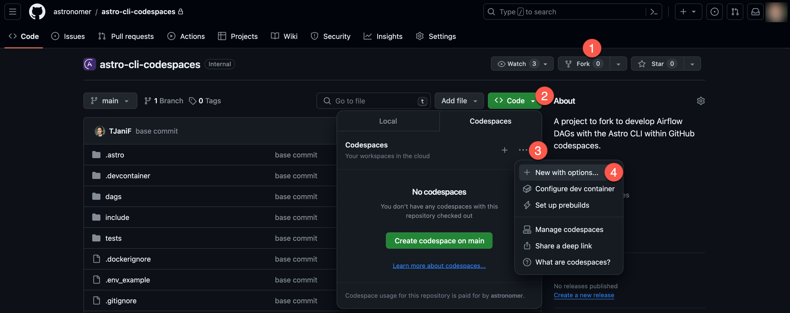
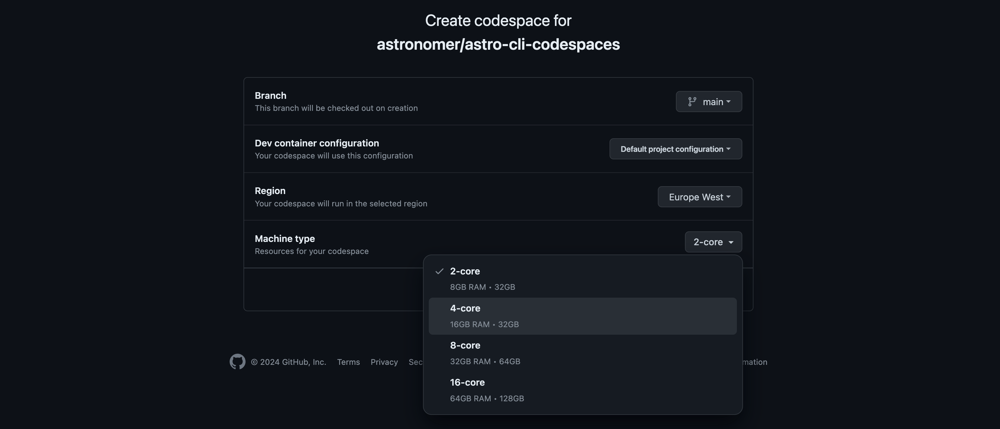
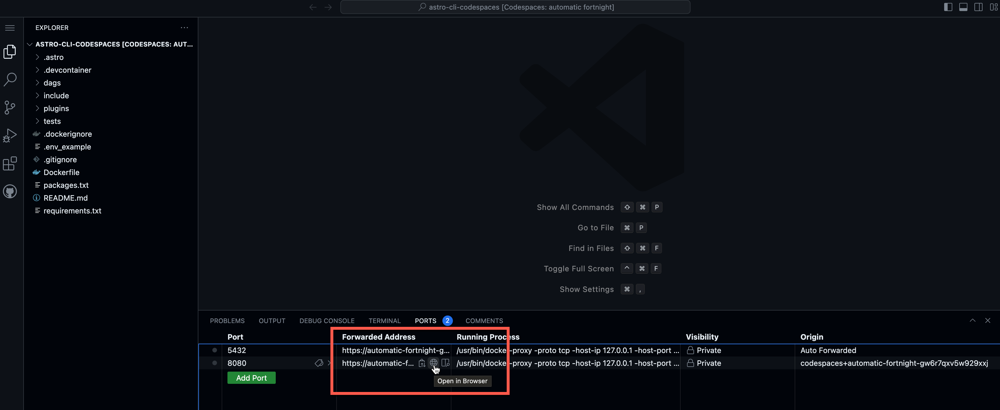
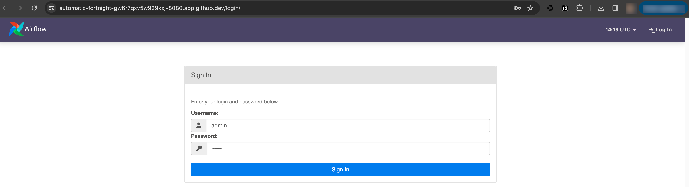

# BAI Airflow run within GitHub Codespaces

## Setting up

Run this Airflow project without installing anything locally.

1. Fork this repository.
2. Create a new GitHub codespaces project on your fork by clicking **...** and **New with options**. Make sure it uses at least 4 cores!

    

    

3. Wait for the codespaces project to start. Once it has started, open a new terminal and run the following command:

    ```bash
    astro dev start
    ```

4. Once the Airflow project has started access the Airflow UI by clicking on the **Ports** tab and opening the forward URL for port 8080.

    

5. Log in to the Airflow UI using the credentials `admin` and `admin`.

    


